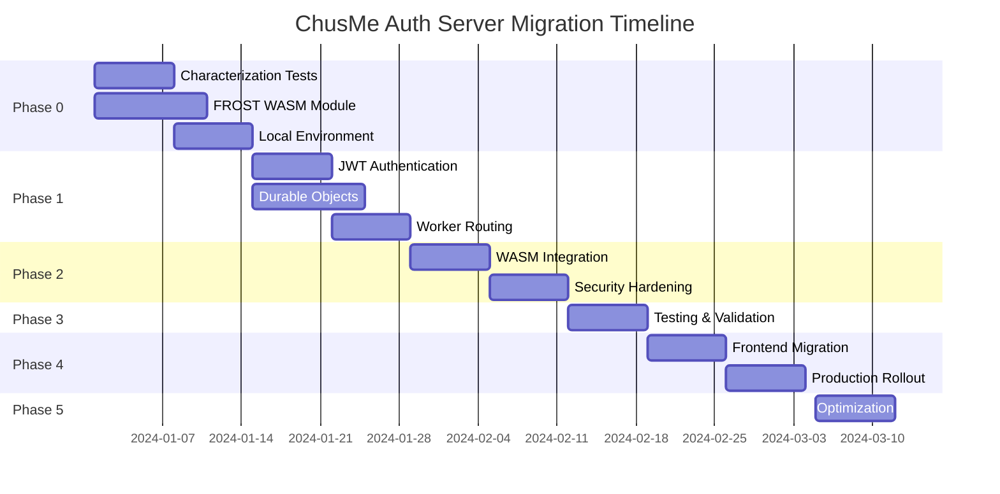

# ChusMe Auth Server: Complete Project Roadmap

## Executive Summary

This document provides the comprehensive roadmap for migrating the ChusMe Auth Server from its current half-finished WebSocket implementation to a production-ready HTTP API using Cloudflare Durable Objects.

**Current State**: Half-finished NIP-46 signing service with mismatched FROST WASM and broken authentication  
**Target State**: Production-ready HTTP API with proper FROST implementation and secure authentication  
**Timeline**: 10 weeks  
**Risk Level**: Medium (well-planned migration with rollback capabilities)

## Critical Issues Resolved

✅ **Architecture Decision**: Durable Objects for FROST ceremony state management  
✅ **WASM Strategy**: Replace DKG-based module with Trusted Dealer using zcash/frost-core  
✅ **Authentication**: JWT-based stateless authentication with refresh tokens  
✅ **Security Model**: HKDF key derivation, rate limiting, constant-time operations  
✅ **Migration Strategy**: Feature flags with graceful rollout and instant rollback

## Key Architectural Decisions

### 1. Durable Objects Architecture
- **Main Worker**: Stateless router handling auth and request forwarding
- **FrostCeremonyDO**: Stateful actor managing individual ceremony lifecycle  
- **Multi-key Storage**: Distributed state to avoid 128KB limits and enable atomic updates

### 2. HTTP-First API Design
- RESTful endpoints with clear semantics
- Idempotent operations for safe retries
- Transport-agnostic design (WebSocket upgrade possible later)
- Comprehensive error handling and validation

### 3. Security-by-Design
- Unguessable operation IDs using `crypto.randomUUID()`
- Participant authorization validation per ceremony
- Constant-time cryptographic operations
- Proper secret zeroization and memory management

## Implementation Phases

### Phase 0: Foundation (Weeks 1-2) 🏗️
**Goal**: Build safety net and validate crypto core

**Key Deliverables**:
- Characterization tests for existing WebSocket API
- New FROST WASM module using zcash/frost-core v2.1.0
- Local development environment with miniflare

**Success Criteria**:
- All existing functionality captured in tests
- WASM crypto operations validated with test vectors
- Local environment supports DO development

### Phase 1: HTTP Foundation (Weeks 3-4) 🔗
**Goal**: Build HTTP API and authentication infrastructure

**Key Deliverables**:
- JWT authentication with refresh tokens
- FrostCeremonyDO with mocked crypto operations
- Main worker routing and DO integration

**Success Criteria**:
- Secure authentication flow working
- Complete state machine logic implemented
- End-to-end request routing functional

### Phase 2: Integration (Weeks 5-6) 🔒
**Goal**: Integrate real crypto and add security hardening

**Key Deliverables**:
- WASM module integrated into Durable Objects
- Security measures (rate limiting, input validation, HKDF)
- Performance monitoring and optimization

**Success Criteria**:
- Real FROST ceremonies working end-to-end
- Security measures preventing common attacks
- Performance within acceptable bounds

### Phase 3: Validation (Week 7) ✅
**Goal**: Comprehensive testing and benchmarking

**Key Deliverables**:
- Full test suite (unit, integration, E2E)
- Performance benchmarks and optimization
- Security testing and validation

**Success Criteria**:
- 90%+ test coverage achieved
- Performance targets met
- No security vulnerabilities found

### Phase 4: Migration (Weeks 8-9) 🚀
**Goal**: Safe production rollout with monitoring

**Key Deliverables**:
- Frontend feature flag system
- Production deployment with monitoring
- Gradual rollout and WebSocket deprecation

**Success Criteria**:
- Successful rollout to 100% of users
- No regressions or data loss
- WebSocket API safely deprecated

### Phase 5: Optimization (Week 10) ⚡
**Goal**: Performance optimization and documentation

**Key Deliverables**:
- Performance optimization based on production metrics
- Security audit and compliance verification
- Complete documentation and runbooks

**Success Criteria**:
- System performing optimally in production
- Security audit passed
- Team trained on new system

## Risk Assessment & Mitigation

### Technical Risks
| Risk | Probability | Impact | Mitigation |
|------|-------------|--------|------------|
| WASM performance issues | Medium | High | Early benchmarking, async optimization |
| DO storage limits exceeded | Low | Medium | Multi-key storage pattern |
| Cold start latency | High | Low | Acceptable for ceremony initiation |
| State corruption | Low | High | Atomic storage operations |

### Security Risks
| Risk | Probability | Impact | Mitigation |
|------|-------------|--------|------------|
| Memory key exposure | Low | Critical | Minimize exposure time, zeroize |
| Ceremony hijacking | Medium | High | Unguessable operation IDs |
| DoS via crypto operations | Medium | Medium | Rate limiting, validation |
| JWT token compromise | Low | High | Short expiry, refresh rotation |

### Migration Risks  
| Risk | Probability | Impact | Mitigation |
|------|-------------|--------|------------|
| Feature regression | Low | High | Characterization tests |
| User experience degradation | Medium | Medium | Feature flag rollback |
| Data loss during migration | Low | Critical | No destructive operations |
| Rollout coordination issues | Medium | Low | Gradual rollout strategy |

## Success Metrics

### Functional Metrics
- [ ] 100% feature parity with existing WebSocket API
- [ ] Zero data loss during migration
- [ ] <2% user-reported issues during rollout
- [ ] All FROST ceremony types working correctly

### Performance Metrics
- [ ] Keygen ceremony: <1 second (2-of-2 participants)
- [ ] Signing ceremony: <500ms total
- [ ] API response time: p95 <2 seconds
- [ ] Uptime: >99.9% during migration period

### Security Metrics
- [ ] Zero security vulnerabilities in audit
- [ ] Rate limiting preventing >95% of attack attempts
- [ ] JWT token security properly implemented
- [ ] Cryptographic operations constant-time verified

## Resource Requirements

### Team Requirements
- **1 Senior Developer**: Rust/WASM crypto implementation
- **1 Full-Stack Developer**: TypeScript/Workers API development  
- **1 DevOps Engineer**: Deployment and monitoring setup
- **1 Security Reviewer**: Crypto and security audit

### Infrastructure Requirements
- **Cloudflare Workers Paid Plan**: For Durable Objects support
- **D1 Database**: User data and session storage
- **Worker Secrets**: JWT signing keys
- **Monitoring Tools**: Observability and alerting

### Timeline & Dependencies

## Next Steps

### Immediate Actions (This Week)
1. **Initialize Git Repository**: ✅ Done
2. **Review Architecture Documents**: Team review of ARCHITECTURE.md
3. **Stakeholder Approval**: Present plan to project stakeholders
4. **Resource Allocation**: Assign team members to workstreams

### Week 1 Kickoff
1. **Phase 0 Sprint Planning**: Create GitHub project board
2. **Environment Setup**: Ensure all developers have required tools
3. **Begin Characterization Testing**: Start with Issue #1
4. **Start FROST WASM Development**: Begin Issue #2 in parallel

### Ongoing Management
- **Weekly Phase Reviews**: Assess progress and risks
- **Daily Standups**: Track individual task progress  
- **Risk Assessment**: Monitor and update risk register
- **Stakeholder Updates**: Weekly progress reports

## Documentation Index

All project documentation is now in place:

📋 **[ARCHITECTURE.md](ARCHITECTURE.md)** - Technical architecture and design decisions  
📅 **[IMPLEMENTATION_PLAN.md](IMPLEMENTATION_PLAN.md)** - Detailed 10-week implementation plan  
🎯 **[GITHUB_ISSUES.md](GITHUB_ISSUES.md)** - Comprehensive GitHub issues for all tasks  
🗺️ **[PROJECT_ROADMAP.md](PROJECT_ROADMAP.md)** - This executive summary and roadmap  

## Conclusion

This roadmap provides a comprehensive, risk-mitigated approach to completing the ChusMe Auth Server. The combination of:

- **Clear architectural decisions** based on Cloudflare platform strengths
- **Security-first design** with proper cryptographic implementations  
- **Phased migration strategy** with rollback capabilities
- **Comprehensive testing** at every stage
- **Detailed task breakdown** with acceptance criteria

...creates a high-confidence path to production success.

The project is well-positioned to deliver a secure, scalable NIP-46 signing service that properly implements FROST threshold signatures while leveraging the full power of the Cloudflare Workers platform.

**Recommendation**: Proceed with Phase 0 immediately to begin building the foundation for this critical infrastructure component.